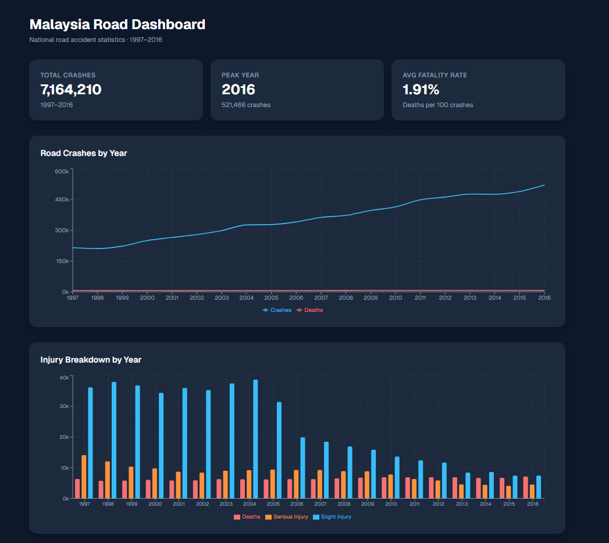

# Malaysia Road Dashboard

A full-stack data dashboard for Malaysian road accident statistics (1997–2016), built with Django REST Framework and Next.js.

## Project Structure

```
malaysia-road-dashboard/
├── general-road-accident-statistics-in-malaysia.xlsx
├── backend/          # Django REST Framework API
└── frontend/         # Next.js dashboard
```

## Dataset

Source: General Road Accident Statistics in Malaysia (Royal Malaysia Police)
- 20 years of national-level data (1997–2016)
- Columns: Year, Road Crashes, Road Deaths, Serious Injury, Slight Injury, Registered Vehicles, Population

## Tech Stack

| Layer    | Technology                                      |
|----------|-------------------------------------------------|
| Backend  | Python, Django 6, Django REST Framework, pandas |
| Frontend | Next.js 16, TypeScript, Tailwind CSS, Recharts  |
| Data     | Excel (.xlsx) via openpyxl / pandas             |

## API Endpoints

| Endpoint                          | Description                                      |
|-----------------------------------|--------------------------------------------------|
| `GET /api/accidents/by-year/`     | Total crashes and deaths per year (1997–2016)    |
| `GET /api/accidents/by-injury-type/` | Deaths, serious, and slight injuries per year |
| `GET /api/accidents/summary/`     | KPI stats: total crashes, peak year, fatality rate |

## Getting Started

### Prerequisites

- Python 3.10+
- Node.js 18+

### Backend Setup

```powershell
cd backend
python -m venv venv
venv\Scripts\activate
pip install -r requirements.txt
python manage.py runserver
```

The API will be available at `http://localhost:8000`.

### Frontend Setup

Open a second terminal:

```powershell
cd frontend
npm install
npm run dev
```

The dashboard will be available at `http://localhost:3000`.

## Dashboard Preview



## Dashboard Features

- **KPI Cards** — Total crashes across all years, peak year, average fatality rate
- **Yearly Trend Chart** — Line chart showing road crashes and deaths from 1997 to 2016
- **Injury Breakdown Chart** — Grouped bar chart comparing deaths, serious injuries, and slight injuries per year
